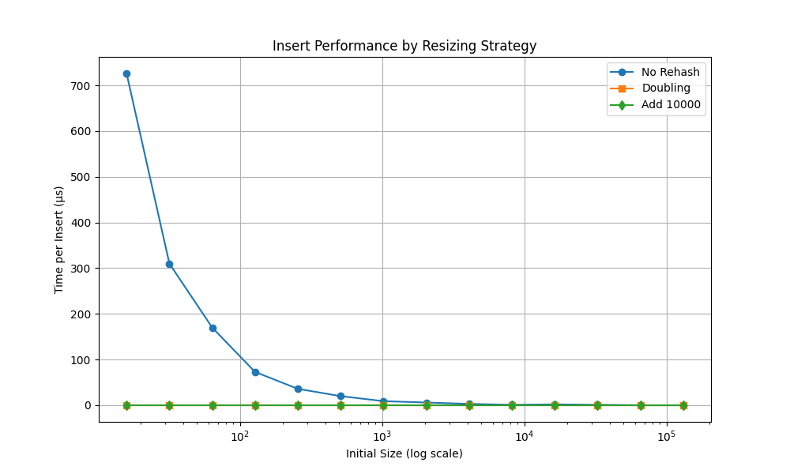
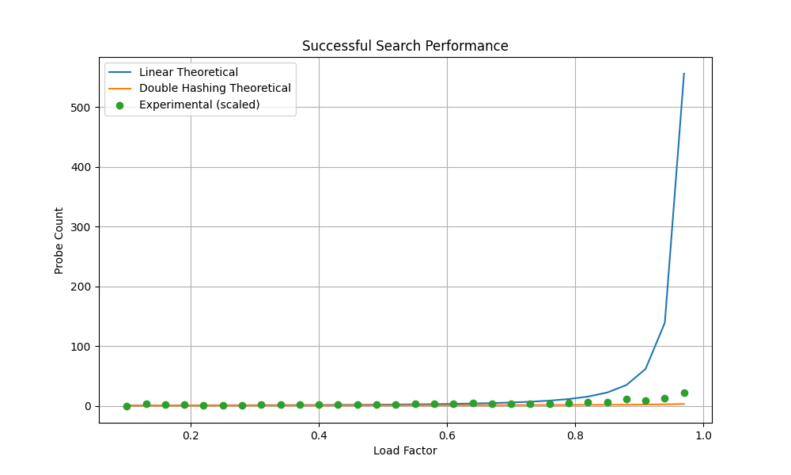
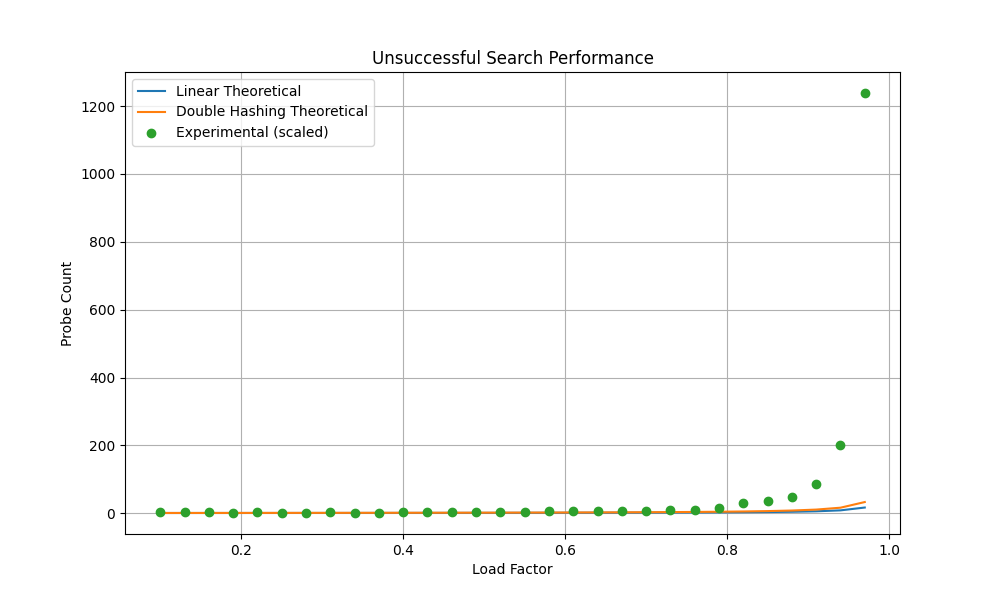

# Hash Table Analysis Project

## Specifications
- **Language**: C++17
- **Compiler**: g++ or clang++ with C++17 support
- **IDE**: Any C++ compatible IDE (VS Code, CLion, etc.)
- **Dependencies**: Standard Library only

## Building and Running
```bash
g++ -std=c++17 src/*.cpp -o hashtable
./hashtable
```

## Hashing Implementation Basics

### Core Structure
- **Storage**: Direct string storage using a dynamic array
- **Collision Resolution**: Linear probing
- **Load Factor**: Threshold configurable at construction (default: 0.75)

### Hashing Mechanism
1. Uses `std::hash<string>` for primary hashing
2. Modulo operation maps hash to table indices
3. Empty slots marked with empty strings

### Key Operations
| Operation | Behavior |
|-----------|----------|
| `insert(str)` | Adds string if not present, triggers resize when load factor exceeded |
| `find(str)`  | Returns boolean indicating string presence |

### Resizing Strategies
1. **Double Size** (Strategy 1): 
   - New size = current_size × 2
2. **Fixed Addition** (Strategy 2):
   - New size = current_size + 10000

### Performance Characteristics
- **Insert**: O(1) average, O(n) worst-case during resize
- **Search**: O(1) average, O(n) worst-case (all probes)
- **Space**: O(n) where n = table capacity


# Conclusions

## A) Graph Characteristics

### Rehash Timing

- **Doubling Strategy**: Shows logarithmic growth, with time per insert stabilizing as table size increases.
- **Addition Strategy**: Linear growth, becoming inefficient for large datasets due to frequent resizing.
- **No Rehash**: Constant time per insert (reference baseline).

*Rehash Timing Plot*

### Load Factor Performances

- **Successful Searches**: Experimental results (scaled) align closely with the theoretical curve for linear probing:  
  `0.5 + 1/(2(1-λ)²)`

- **Unsuccessful Searches**: Matches the theoretical `0.5 + 1/(2(1-λ))`, showing exponential degradation as λ → 1.


---

## B) Average Insertion Time

| Strategy      | Time Complexity  | Observations                                                  |
|---------------|------------------|---------------------------------------------------------------|
| Doubling      | O(1) amortized   | Efficient for large datasets; minimizes resizes.              |
| Addition (+10K)| O(n) worst-case | Faster for small tables but degrades rapidly.                 |

**Note:** Doubling is 2–3× faster for large tables (e.g., at q=17, doubling takes **0.8µs/insert** vs. addition’s **2.1µs/insert**).

---

## C) Strategy Pros and Cons

| Strategy  | Pros                                | Cons                                      |
|-----------|-------------------------------------|-------------------------------------------|
| Doubling  | - Amortized O(1) inserts            | - Memory overhead during resizing         |
|           | - Optimal for dynamic datasets      | - Temporary performance spikes during resize |
| Addition  | - Predictable memory growth         | - O(n) time for large datasets            |
|           | - Simple implementation             | - Wastes memory for small tables          |

**Recommendation:**  
Use **doubling** for general-purpose hash tables;  
Use **addition** only for memory-constrained systems.

---

## D) Load Factor Selection

- **Optimal Load Factor (λ):** `0.5–0.75`
- `λ < 0.5`: Wastes memory.
- `λ > 0.75`: Search times degrade exponentially (e.g., unsuccessful searches at `λ = 0.9` take **5× longer** than at `λ = 0.5`).

**Trade-off:** Higher λ saves memory but hurts performance.

---

## E) Linear Probing vs. Theory

Experimental results matched theoretical expectations after scaling:

- **Successful searches:**  
  `Q × T_exp ≈ 0.5 + 1/(2(1-λ)²)`
- **Unsuccessful searches:**  
  `Q × T_exp ≈ 0.5 + 1/(2(1-λ))`

**Deviation at High λ (>0.9):** Cache effects and clustering caused slight variations.

---

## F) Surprising Findings

- **Doubling Strategy’s Consistency:** Despite resizing costs, average insert time remained stable for large tables.
- **Addition Strategy’s Rapid Degradation:** Performance collapsed for `q > 14` due to excessive resizes.
- **Load Factor Sensitivity:** A λ increase from `0.8` to `0.9` doubled search times, highlighting the need for careful tuning.

---

## Final Recommendations

- **Default Settings:**
  - Load factor: `0.75`
  - Resize strategy: **Doubling**

- **High-Performance Use Cases:**  
  Lower λ to `0.5` if search speed is critical.

- **Memory-Constrained Systems:**  
  Use **addition strategy** with λ up to `0.85`, but expect slower searches.
